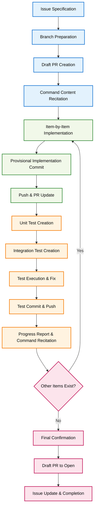

# Issue to PR Workflow

## 🎯 Core Principle: Complete Automation of Issues-Driven Development

**Create systematic PRs and implementation from specified GitHub Issues numbers, realizing reliable development with emphasis on specification testing.**

## 🚀 AUTOMATIC RESUME EXECUTION

**Detecting current context and executing resume logic...**

Current branch: `feature/issue-6-organize-pr-review-commands`
Detected Issue number: **6**
PR Status: **#18 exists (OPEN)**

**✅ RESUMING ISSUE #6 WORKFLOW FROM CURRENT STATE**

Proceeding with Issue #6 implementation workflow. Analyzing current progress and determining next steps...

## 🔄 Resume Functionality

**When executed without arguments:**
- Automatically detect current branch and associated Issue/PR
- Resume workflow from the appropriate stage based on current state
- Continue implementation where it was left off
- Maintain full workflow compliance including mandatory recitations

**IMPLEMENTATION NOTE**: This command automatically executes the Resume Detection Phase when no arguments are provided.

## 📊 Development Workflow



## 🚀 Execution Steps

### 0. Resume Detection Phase (When No Arguments Provided)

**Automatic State Detection and Execution:**

First, determine current context:
- Current branch: `$(git branch --show-current)`
- Extract Issue number from branch name: `$(git branch --show-current | grep -o 'issue-[0-9]\+' | grep -o '[0-9]\+')`
- Check for existing PR: `$(gh pr view --json number,state --jq '{number: .number, state: .state}' 2>/dev/null)`

**Resume Logic Implementation:**

1. **Extract Issue Number from Current Branch:**
   ```bash
   CURRENT_BRANCH=$(git branch --show-current)
   ISSUE_NUMBER=$(echo "$CURRENT_BRANCH" | grep -o 'issue-[0-9]\+' | grep -o '[0-9]\+')
   ```

2. **Check PR Status:**
   ```bash
   PR_INFO=$(gh pr view --json number,state,title --jq '{number: .number, state: .state, title: .title}' 2>/dev/null)
   ```

3. **Execute Resume Decision:**
   - If Issue number detected AND PR exists: Resume from current PR state
   - If Issue number detected AND no PR: Start fresh workflow for detected Issue
   - If no Issue number detected: Show error and usage information

**Current Context Analysis:**
- Branch: `feature/issue-6-organize-pr-review-commands`
- Detected Issue: #6
- PR Status: #18 (OPEN/DRAFT)
- Action: Continue Issue #6 workflow from current state

**IMMEDIATE EXECUTION:**
When this command is invoked without arguments, the following detection and resume logic will execute automatically:

```bash
# Execute detection logic
CURRENT_BRANCH=$(git branch --show-current)
ISSUE_NUMBER=$(echo "$CURRENT_BRANCH" | grep -o 'issue-[0-9]\+' | grep -o '[0-9]\+')
PR_INFO=$(gh pr view --json number,state,title --jq '{number: .number, state: .state, title: .title}' 2>/dev/null)

# Current context: Issue #6, PR #18 exists
# Resume action: Continue with Issue #6 implementation workflow
```

**State-Based Resume Points:**
- **No PR exists**: Start from Initial Preparation Phase
- **Draft PR exists, no commits**: Resume from Command Recitation
- **Draft PR with commits, no tests**: Resume from Test Implementation Phase  
- **Draft PR with tests**: Resume from Final Completion Phase
- **Open PR exists**: Workflow already complete

### 1. Initial Preparation Phase

**Branch and PR Preparation:**
- Move to default branch (main)
- Update local branch to latest state (`git pull origin main`)
- Fetch and analyze specified Issues content
- Create appropriate branch name based on Issue content
- Create new branch
- Create Draft PR and ensure Issue link is properly set

**Initial Command Content Recitation:**
- **MANDATORY**: After Draft PR creation, recite the ENTIRE issue-to-pr command file content word-for-word
- This ensures complete understanding of the workflow before proceeding
- Only proceed to implementation after full recitation is complete

### 2. Item-by-Item Implementation Phase

**Progressive Implementation:**
- Organize Issues response items in order
- Implement provisional implementation for each item
- Commit immediately after provisional implementation completion
- Execute push after commit
- Update Draft PR description to clearly show progress status

### 3. Comprehensive Test Implementation Phase

**Automated Test Creation with Mock Strategy:**

**Unit Test Implementation:**
- Create comprehensive unit tests for each implemented component
- Use appropriate mocking frameworks for external dependencies
- Test edge cases, error conditions, and boundary values
- Ensure high code coverage (aim for >90% for new code)
- Mock external APIs, file systems, and network calls appropriately
- Validate internal logic independently from external systems

**Integration Test Implementation:**
- Create integration tests where specification requires system interaction
- Test component interactions and data flow
- Mock only external dependencies outside the system boundary
- Verify end-to-end functionality for critical user workflows
- Test error handling and recovery scenarios

**Specification Compliance Testing:**
- **First Priority**: Verify if specifications are met through automated tests
- Create test cases that directly validate acceptance criteria
- Execute all tests (unit + integration) and verify results
- Fix implementation if tests reveal oversights or errors
- **Important**: Prioritize achieving correct specification state validated by tests
- Commit & push after all tests pass
- PR progress report: Include test coverage and specification compliance status

### 4. Progress Report Phase

**Execution Command Content Recitation:**
- **MANDATORY**: After each implementation item completion (including tests), recite the ENTIRE issue-to-pr command file content word-for-word
- This ensures workflow adherence and prevents deviation from specified process
- After recitation completion, proceed to next implementation item
- Repeat the flow from item implementation until all specified Issue requirements are complete

### 5. Final Completion Phase

**Completion and Quality Assurance:**
- Final commit & push of all implementation items and tests
- Verify branch implementation content with `git log`
- Run complete test suite to ensure all tests pass
- Update PR description to latest status with test coverage report
- Record remaining issues in PR comments if any

**Draft PR to Open Conversion:**
- **MANDATORY**: Convert Draft PR to Open (ready for review) status
- Use command: `gh pr ready <PR_NUMBER>` or equivalent GitHub CLI command
- Ensure PR title and description accurately reflect completed work
- Add appropriate labels and reviewers as needed

**Final Issue Update:**
- Update Issue status to completed/closed
- Link the merged PR in Issue comments
- Document any additional notes or follow-up items discovered during implementation

## 📝 Usage Examples

### Fresh Start with Issue Number
```bash
# Start implementing functionality for specified Issue
/issue-to-pr 42

# Execution result example (for Issue #42):
# 1. Move to main branch and update
# 2. Create feature/issue-42-add-metrics-export branch
# 3. Create Draft PR (linked with Issue #42)
# 4. **RECITE ENTIRE COMMAND CONTENT**
# 5. Provisional implementation of metrics collection functionality
# 6. Unit tests for metrics collection with mocks
# 7. Integration tests for metrics collection
# 8. Commit, push, and progress report
# 9. **RECITE ENTIRE COMMAND CONTENT**
# 10. Provisional implementation of export functionality  
# 11. Unit tests for export functionality with mocks
# 12. Integration tests for export functionality
# 13. Commit, push, and progress report
# 14. Final test suite execution and coverage verification
# 15. **Convert Draft PR to Open status**
# 16. Final confirmation and Issue completion
```

### Resume Existing Work (No Arguments)
```bash
# Resume work on current branch automatically
/issue-to-pr

# Automatic detection and resume examples:

# Scenario 1: On feature/issue-42-add-metrics-export branch with Draft PR
# Result: Auto-detects Issue #42, resumes from current stage

# Scenario 2: On feature/issue-42-add-metrics-export branch, implementation started
# Result: Auto-detects Issue #42, resumes from Test Implementation Phase

# Scenario 3: On main branch
# Result: ❌ Cannot detect Issue number from current context

# Scenario 4: On feature/issue-42-add-metrics-export branch with Open PR
# Result: ✅ Workflow already complete for Issue #42
```

## ⚠️ Important Notes

**Resume Functionality Requirements:**
- **AUTO-DETECTION**: When no arguments provided, automatically detect Issue from current context
- **STATE AWARENESS**: Resume from appropriate workflow stage based on current progress
- **BRANCH PATTERN**: Supports branch names like `feature/issue-N-description` or `issue-N-description`
- **PR STATE**: Analyzes Draft/Open PR status to determine resume point

**Command Content Recitation Requirements:**
- **MANDATORY**: Must recite ENTIRE command file content after Draft PR creation (fresh start or resume)
- **MANDATORY**: Must recite ENTIRE command file content after each implementation item completion
- **NO EXCEPTIONS**: Cannot proceed without complete recitation
- **RESUME RECITATION**: Must recite when resuming workflow, regardless of entry point
- Ensures workflow adherence and prevents process deviation

**Automated Test Requirements:**
- **MANDATORY**: Create comprehensive unit tests with appropriate mocking
- **MANDATORY**: Create integration tests where specification requires
- **NO MANUAL TESTING ONLY**: All functionality must be covered by automated tests
- Use mocking frameworks for external dependencies (APIs, file system, network)
- Achieve high test coverage (>90% for new code)

**Draft PR to Open Conversion:**
- **MANDATORY**: Must convert Draft PR to Open status upon completion
- Use `gh pr ready <PR_NUMBER>` command
- **FAILURE TO CONVERT**: Results in incomplete workflow execution

**Specification Test Priority Principle:**
- Prioritize correct specification implementation validated by automated tests
- Accurately report test coverage and specification compliance status
- Ensure all tests pass before final completion

**Thorough Issue・PR Integration:**
- Always set Issue link when creating Draft PR
- Maintain accuracy and transparency of progress reports with test results
- Clear identification and proper recording of remaining issues

**Continuous Quality Assurance:**
- Emphasize gradual completion of each implementation item with tests
- Regular verification of implementation content through git log and test execution
- Continuous updating of PR description with test coverage information

## 📚 Related Information

- Automation using GitHub Issues API
- Progressive development utilizing Draft PR functionality
- Comprehensive automated testing with mocking strategies
- Test-Driven Development and Specification-Driven Testing methodology
- Git workflow optimization patterns
- Draft PR to Open conversion best practices