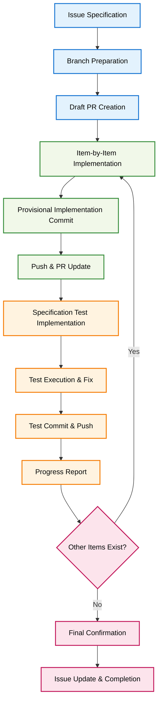

# Issue to PR Workflow

## 🎯 Core Principle: Complete Automation of Issues-Driven Development

**Create systematic PRs and implementation from specified GitHub Issues numbers, realizing reliable development with emphasis on specification testing.**

## 📊 Development Workflow



## 🚀 Execution Steps

### 1. Initial Preparation Phase

**Branch and PR Preparation:**
- Move to default branch (main)
- Update local branch to latest state (`git pull origin main`)
- Fetch and analyze specified Issues content
- Create appropriate branch name based on Issue content
- Create new branch
- Create Draft PR and ensure Issue link is properly set

### 2. Item-by-Item Implementation Phase

**Progressive Implementation:**
- Organize Issues response items in order
- Implement provisional implementation for each item
- Commit immediately after provisional implementation completion
- Execute push after commit
- Update Draft PR description to clearly show progress status

### 3. Specification Test Implementation Phase

**Quality Assurance through Test-Driven Development:**
- **First Priority**: Verify if specifications are met
- Create specification compliance tests for current implementation point
- Execute tests and verify results
- Fix implementation if there are oversights or errors
- **Important**: Prioritize achieving correct specification state over passing tests
- Commit & push after test passes
- PR progress report: Clearly distinguish between partial completion and incomplete items

### 4. Progress Report Phase

**Execution Command Content Recitation:**
- After each stage completion, recite the entire issue-to-pr command file content as-is
- After recitation completion, proceed to next implementation item
- Repeat the flow from Draft PR creation until specified Issues completion

### 5. Final Completion Phase

**Completion and Quality Assurance:**
- Final commit & push of all implementation items
- Verify branch implementation content with `git log`
- Update PR description to latest status
- Record remaining issues in PR comments if any
- Final update of Issue status

## 📝 Usage Example

```bash
# Start implementing functionality for specified Issue
/issue-to-pr $ARGUMENTS

# Execution result example (for Issue #42):
# 1. Move to main branch and update
# 2. Create feature/issue-42-add-metrics-export branch
# 3. Create Draft PR (linked with Issue #42)
# 4. Provisional implementation of metrics collection functionality
# 5. Provisional implementation of export functionality
# 6. Specification test implementation for each functionality
# 7. Final confirmation and Issue completion
```

## ⚠️ Important Notes

**Specification Test Priority Principle:**
- Prioritize correct specification implementation over test passing
- Accurately report partial completion status and clarify completion scope
- Ensure commit & push execution at each stage

**Thorough Issue・PR Integration:**
- Always set Issue link when creating Draft PR
- Maintain accuracy and transparency of progress reports
- Clear identification and proper recording of remaining issues

**Continuous Quality Assurance:**
- Emphasize gradual completion of each implementation item
- Regular verification of implementation content through git log
- Continuous updating of PR description

## 📚 Related Information

- Automation using GitHub Issues API
- Progressive development utilizing Draft PR functionality
- Specification-Driven Testing methodology
- Git workflow optimization patterns