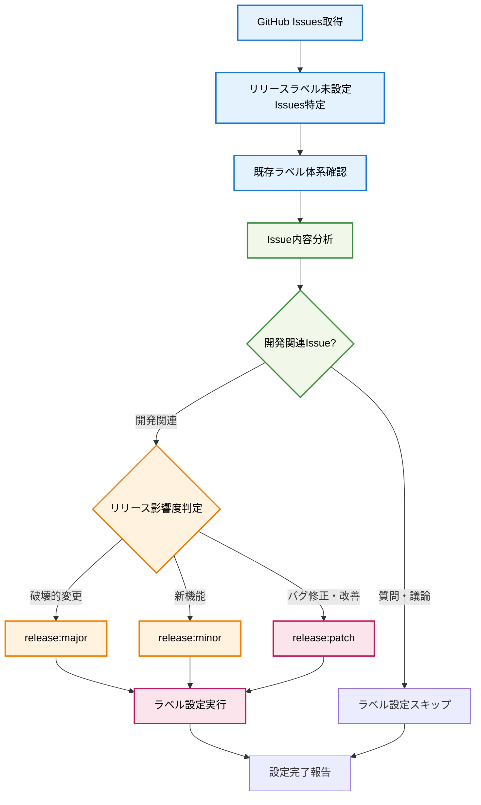

# Label Issues

## 🎯 基本原則: リリース影響度に基づく自動ラベル設定

**GitHubのissuesでリリースラベル（release:major/minor/patch）が設定されていない開発関連issuesに、内容を分析して適切なリリースラベルを自動設定する**

## 📊 ラベル設定フロー



## 🚀 実行手順

### 1. Issues一覧の取得と分析

```bash
# 全Issues取得（ラベル情報含む）
gh issue list --state all --json number,title,labels,state,body

# 既存ラベル体系の確認
gh api repos/{owner}/{repo}/labels
```

**分析ポイント:**
- リリースラベル（`release:major`, `release:minor`, `release:patch`）が設定されていないissuesを特定
- 既存ラベルに `bug`, `enhancement`, `question` 等がある場合はその情報も考慮
- 既存のリリースラベル体系を確認（release:major, release:minor, release:patch）

### 2. Issue内容の分析と判定

まず開発関連issueかどうかを判定し、該当する場合のみリリースレベルを決定：

**リリースラベル設定対象外（スキップ）:**
- `question` ラベルが付いている質問系issue
- 議論や提案のみで実装を伴わないissue  
- ドキュメントのみの更新
- テンプレートや設定ファイルの更新のみ

**リリースラベル設定対象（開発関連）:**

**release:major (破壊的変更):**
- CLI コマンド構造の変更
- デフォルト動作の変更 
- プロジェクト名やコマンド名の変更
- 既存ユーザーの動作に影響する変更
- 設定ファイル形式の変更

**release:minor (新機能):**
- 新しい機能の追加
- 新しいコマンドやオプションの追加
- 後方互換性を保った機能拡張
- パフォーマンス向上
- 自動化機能の追加

**release:patch (バグ修正・改善):**
- バグ修正
- エラーハンドリングの改善
- ドキュメント修正
- 出力メッセージの改善
- 内部リファクタリング（動作変更なし）

### 3. 一括ラベル設定の実行

```bash
# 各issueに適切なラベルを設定
gh issue edit {issue_number} --add-label "release:{level}"
```

**実行例:**
```bash
gh issue edit 52 --add-label "release:major"  # CLI構造変更
gh issue edit 51 --add-label "release:major"  # デフォルト動作変更
gh issue edit 44 --add-label "release:patch"  # 出力改善
gh issue edit 43 --add-label "release:patch"  # エラー処理改善
```

### 4. 設定結果の確認と報告

設定完了後、以下の情報を報告：
- 処理したissues数
- 各リリースレベル別の件数
- 設定したラベルの詳細

## 📝 判定基準の詳細

### Major Version 基準
- **CLI Breaking Changes**: コマンド名、引数、動作の変更
- **User Workflow Impact**: 既存ユーザーの操作手順に影響
- **Configuration Changes**: 設定ファイル形式の変更
- **API Changes**: 外部統合への影響

### Minor Version 基準  
- **New Features**: 新機能追加（既存機能に影響なし）
- **Enhancement**: 既存機能の拡張
- **Performance**: パフォーマンス向上
- **Automation**: 新しい自動化機能

### Patch Version 基準
- **Bug Fixes**: 動作不正の修正
- **Error Handling**: エラー処理の改善
- **Documentation**: ドキュメント更新
- **Refactoring**: 内部構造改善（動作変更なし）

## ⚠️ 注意事項

- **手動確認必須**: AI判定結果は提案として扱い、最終的にはissue内容を手動確認する
- **対象外issueのスキップ**: 質問・議論系issueはリリースラベル設定をスキップ
- **既存ラベルとの併用**: `bug`, `enhancement`等の既存ラベルは保持し、リリースラベルを追加
- **セマンティックバージョニング遵守**: 既存のVERSIONING.mdルールに従う
- **一貫性保持**: 似たような変更には同じレベルを適用
- **エラー処理**: ラベル設定失敗時は個別にエラー報告

## 🔍 使用例

**実行前の状況:**
```
Issue #52: AI command structure refactor (enhancement)
Issue #51: Change default behavior (enhancement) 
Issue #44: Installation script verbose (bug)
Issue #25: How to configure authentication? (question)
```

**実行後の結果:**
```
✅ Issue #52: enhancement, release:major (CLI構造の破壊的変更)
✅ Issue #51: enhancement, release:major (デフォルト動作の変更)
✅ Issue #44: bug, release:patch (出力改善のみ)
⏭️  Issue #25: question (質問系のためスキップ)

処理完了: 4件のissuesを確認、3件にリリースラベルを設定
- Major: 2件
- Minor: 0件  
- Patch: 1件
- スキップ: 1件
```

## 📚 関連情報

- [VERSIONING.md](../VERSIONING.md): バージョン管理ルール
- [GitHub CLI Documentation](https://cli.github.com/manual/): gh issue commands
- [Semantic Versioning](https://semver.org/): セマンティックバージョニング規則

---

**このコマンドにより、issue管理とリリース計画が効率化され、適切なバージョン管理が実現できます。**