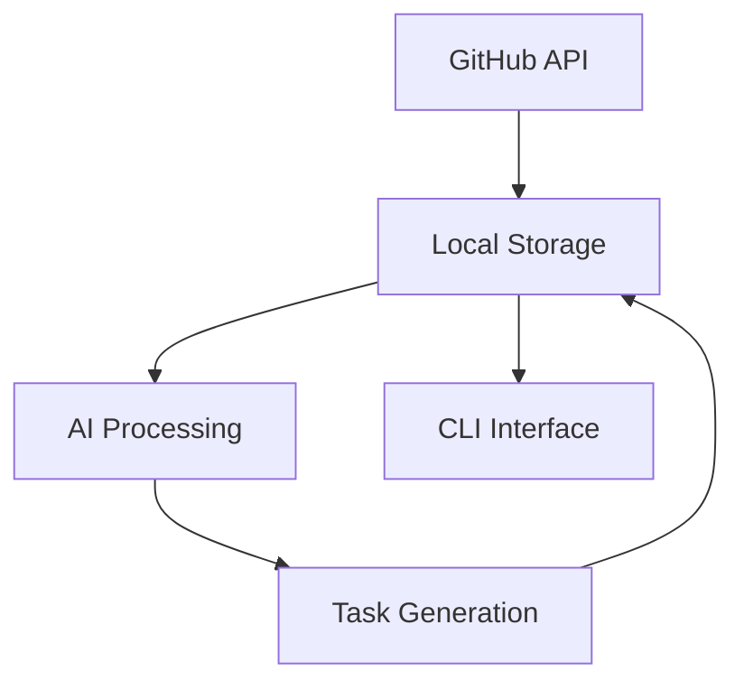
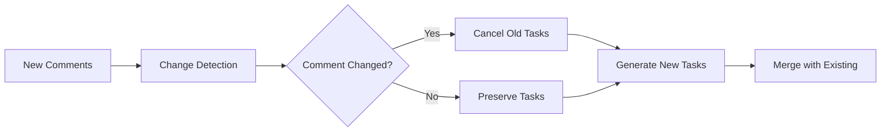
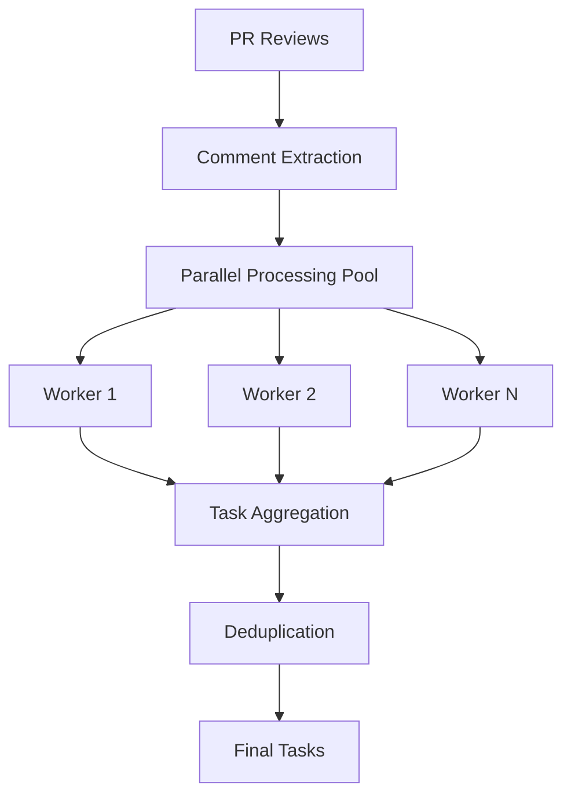

# Architecture Overview

This document provides a comprehensive overview of reviewtask's architecture, design decisions, and implementation details.

## Core Philosophy

reviewtask is built on several foundational principles:

### 1. Zero Feedback Loss Policy
- **Every actionable review comment must be captured and tracked**
- **No developer should need to manually track what needs to be done**
- **Review discussions should translate directly into work items**

### 2. State Preservation is Sacred
- **Developer work progress is never lost due to tool operations**
- **Task statuses reflect real work and must be preserved across all operations**
- **Tool should adapt to developer workflow, not force workflow changes**

### 3. AI-Assisted, Human-Controlled
- **AI provides intelligent task generation and prioritization**
- **Developers maintain full control over task status and workflow**
- **Automation reduces cognitive overhead without removing agency**

### 4. Simplicity Over Features
- **Core workflow should be immediately intuitive**
- **Advanced features are optional and discoverable**
- **CLI commands follow standard patterns and conventions**

## Technology Stack

### Core Technology Choices

#### Go Programming Language
- **Rationale**: CLI tools benefit from Go's single-binary distribution and cross-platform support
- **Benefits**: Fast compilation, excellent concurrency support, rich standard library
- **Rule**: All core functionality implemented in Go with minimal external dependencies

#### Claude Code CLI Integration
- **Rationale**: Provides best-in-class AI analysis while maintaining local control
- **Benefits**: Leverages Anthropic's advanced language models, no direct API management
- **Rule**: All AI processing goes through Claude Code CLI, no direct API calls

#### JSON-based Local Storage
- **Rationale**: Human-readable, git-trackable, and easily debuggable
- **Benefits**: Simple format, version control friendly, easy inspection and modification
- **Rule**: All data stored as structured JSON with clear schema

#### GitHub API Integration
- **Rationale**: Direct integration provides real-time data and comprehensive access
- **Benefits**: Official API, comprehensive access to PR and review data
- **Rule**: Multi-source authentication with fallback strategies

## Project Structure

```
reviewtask/
├── cmd/                    # CLI command implementations (Cobra pattern)
│   ├── auth.go            # Authentication management
│   ├── claude.go          # AI provider integration
│   ├── config.go          # Configuration management
│   ├── debug.go           # Debug and troubleshooting commands
│   ├── fetch.go           # Main PR analysis workflow
│   ├── root.go            # Root command and global flags
│   ├── show.go            # Task display and details
│   ├── stats.go           # Statistics and analytics
│   ├── status.go          # Task status management
│   ├── update.go          # Task status updates
│   └── version.go         # Version management and updates
├── internal/              # Private implementation packages
│   ├── ai/               # AI integration and task generation
│   ├── github/           # GitHub API client and authentication
│   ├── storage/          # Data persistence and task management
│   ├── config/           # Configuration management
│   ├── setup/            # Repository initialization
│   ├── tasks/            # Task management utilities
│   ├── verification/     # Data validation and integrity
│   └── version/          # Version checking and updates
├── docs/                 # Documentation
├── scripts/              # Build, release, and installation scripts
└── .pr-review/           # Per-repository data storage (gitignored auth)
    ├── config.json       # Project configuration
    ├── auth.json         # Authentication (gitignored)
    └── PR-{number}/      # Per-PR data
        ├── info.json     # PR metadata
        ├── reviews.json  # Review data
        └── tasks.json    # Generated tasks
```

### Architectural Rules

- **cmd/** contains only CLI interface logic
- **internal/** packages are single-responsibility focused
- **No circular dependencies between internal packages**
- **Configuration-driven behavior over hard-coded logic**

## Data Architecture

### Local-First Approach



**Benefits:**
- No cloud dependencies for core functionality
- Git integration for sharing configuration (not sensitive data)
- Fast access to historical data
- Works offline for existing data

### Data Flow

1. **Fetch Phase**: GitHub API → Local JSON storage
2. **Analysis Phase**: Local storage → AI provider → Task generation
3. **Management Phase**: Task updates → Local storage
4. **Display Phase**: Local storage → CLI output

### State Preservation Strategy



- Task statuses are treated as source of truth
- Tool operations never overwrite user work progress
- Merge conflicts resolved in favor of preserving human work

## Core Components

### AI Processing Pipeline

#### Comment Analysis
```go
type CommentProcessor struct {
    client    ClaudeClient
    chunker   CommentChunker
    validator TaskValidator
    monitor   ResponseMonitor
}
```

**Features:**
- Parallel processing of multiple comments
- Automatic chunking for large comments (>20KB)
- JSON recovery for incomplete responses
- Quality validation with retry logic

#### Task Generation
```go
type Task struct {
    ID          string    `json:"id"`
    Title       string    `json:"title"`
    Description string    `json:"description"`
    Priority    string    `json:"priority"`
    Status      string    `json:"status"`
    CommentID   string    `json:"comment_id"`
    CreatedAt   time.Time `json:"created_at"`
    UpdatedAt   time.Time `json:"updated_at"`
}
```

#### Deduplication Engine
```go
type TaskDeduplicator struct {
    client             ClaudeClient
    similarityThreshold float64
    enabled            bool
}
```

**Algorithm:**
1. Compare new tasks against existing tasks
2. Use AI-powered similarity analysis
3. Merge similar tasks while preserving status
4. Configurable similarity threshold

### GitHub Integration

#### Authentication Hierarchy
```go
type AuthManager struct {
    sources []AuthSource
}

type AuthSource interface {
    GetToken() (string, error)
    GetUser() (*github.User, error)
    Validate() error
}
```

**Priority order:**
1. Environment variable (`GITHUB_TOKEN`)
2. Local configuration file (`.pr-review/auth.json`)
3. GitHub CLI integration (`gh auth token`)

#### API Client
```go
type Client struct {
    github   *github.Client
    cache    *Cache
    rateLim  *RateLimiter
}
```

**Features:**
- Automatic rate limiting
- Response caching
- Retry logic for transient failures
- Multi-source authentication

### Storage System

#### File Structure
```
.pr-review/
├── config.json              # Project configuration
├── auth.json                 # Authentication (gitignored)
├── cache/                    # API response cache
│   └── reviews-{pr}-{hash}.json
└── PR-{number}/
    ├── info.json            # PR metadata
    ├── reviews.json         # Review data with nested comments
    └── tasks.json           # AI-generated tasks
```

#### Data Models
```go
type PRInfo struct {
    Number      int       `json:"number"`
    Title       string    `json:"title"`
    Branch      string    `json:"branch"`
    LastUpdated time.Time `json:"last_updated"`
}

type ReviewData struct {
    Reviews  []Review  `json:"reviews"`
    Comments []Comment `json:"comments"`
    FetchedAt time.Time `json:"fetched_at"`
}

type TaskData struct {
    Tasks     []Task    `json:"tasks"`
    Generated time.Time `json:"generated_at"`
    Version   string    `json:"version"`
}
```

## Performance Architecture

### Parallel Processing



**Benefits:**
- Reduced processing time for large PRs
- Better AI provider reliability (smaller prompts)
- Improved error isolation (one comment failure doesn't affect others)

### Caching Strategy

```go
type Cache struct {
    storage map[string]CacheEntry
    ttl     time.Duration
}

type CacheEntry struct {
    Data      interface{} `json:"data"`
    ExpiresAt time.Time   `json:"expires_at"`
    Hash      string      `json:"hash"`
}
```

**Levels:**
1. **API Response Cache**: GitHub API responses cached for 1 hour
2. **Processing Cache**: Avoid reprocessing unchanged comments
3. **Task Cache**: Preserve task statuses across runs

### Optimization Features

#### Automatic Performance Scaling
- Small PRs: Fast, simple processing
- Large PRs: Parallel processing, chunking, and optimization
- Auto-detection based on comment count and size

#### Resource Management
- Configurable concurrency limits
- Memory-efficient streaming for large responses
- Graceful degradation under resource constraints

## Security Architecture

### Authentication Security
```go
type SecureAuth struct {
    tokenValidator TokenValidator
    permChecker    PermissionChecker
    rateLimiter    RateLimiter
}
```

**Features:**
- Token validation and permission checking
- Secure storage with restricted file permissions
- No token logging or exposure in errors
- Rate limiting to prevent abuse

### Data Security
- Local storage only (no cloud data transmission)
- Gitignore patterns for sensitive files
- File permission restrictions (600 for auth files)
- No sensitive data in log output

### AI Provider Security
- No direct API key management
- All AI processing through local CLI tools
- No data transmission to external services
- Local prompt processing and response handling

## Extensibility Architecture

### AI Provider Interface
```go
type AIProvider interface {
    GenerateTasks(comments []Comment, config Config) ([]Task, error)
    ValidateTasks(tasks []Task) (ValidationResult, error)
    DeduplicateTasks(existing, new []Task) ([]Task, error)
}
```

**Current providers:**
- Claude Code CLI
- Stdout (for testing and debugging)

**Future providers:**
- OpenAI API
- Local models (Ollama)
- Custom providers

### Plugin Architecture
```go
type Plugin interface {
    Name() string
    Version() string
    Process(data PluginData) (PluginResult, error)
}
```

**Extension points:**
- Custom task processors
- Additional authentication sources
- Custom output formatters
- Integration with external tools

## Error Handling and Recovery

### Resilience Patterns

#### Circuit Breaker
```go
type CircuitBreaker struct {
    maxFailures int
    timeout     time.Duration
    state       CircuitState
}
```

**Application:**
- GitHub API failures
- AI provider unavailability
- Network connectivity issues

#### Retry Strategy
```go
type RetryStrategy struct {
    maxAttempts int
    backoff     BackoffStrategy
    conditions  []RetryCondition
}
```

**Retry conditions:**
- Transient network errors
- Rate limiting (with exponential backoff)
- AI provider temporary failures

#### JSON Recovery
```go
type JSONRecovery struct {
    parser      *PartialParser
    validator   *DataValidator
    threshold   float64
}
```

**Capabilities:**
- Recover partial task data from truncated responses
- Validate and clean malformed JSON
- Extract usable content from incomplete API responses

## Monitoring and Observability

### Performance Monitoring
```go
type ResponseMonitor struct {
    metrics    map[string]Metric
    analytics  *Analytics
    thresholds map[string]float64
}
```

**Tracked metrics:**
- API response times
- Task generation success rates
- Error patterns and frequency
- Resource usage patterns

### Analytics
- Response size analysis
- Truncation pattern detection
- Success rate tracking
- Performance optimization recommendations

### Logging
```go
type Logger struct {
    level   LogLevel
    writers []io.Writer
    format  LogFormat
}
```

**Log levels:**
- Error: Critical failures and errors
- Warn: Non-critical issues and warnings
- Info: General operational information
- Debug: Detailed debugging information (verbose mode)

## Development and Operational Guidelines

### Code Organization Rules
- Follow Go standard project layout
- Each command gets its own file in `cmd/`
- Business logic stays in `internal/` packages
- Configuration changes require documentation updates

### CLI Design Principles
- Commands follow `gh` CLI patterns and conventions
- Help text includes practical examples
- Error messages provide actionable guidance
- Progressive disclosure: simple commands first, advanced features discoverable

### Testing Strategy
- Focus on workflow testing over unit testing
- Test real user scenarios end-to-end
- Mock external dependencies (GitHub API, Claude CLI)
- Manual testing of authentication flows

### Release Management
- Semantic versioning with automated releases
- Cross-platform binary distribution
- Automated testing and quality checks
- Clear migration guides for breaking changes

## Future Architecture Considerations

### Planned Enhancements

#### Multi-Provider AI Support
- Plugin-based AI provider system
- Provider selection and fallback logic
- Performance comparison and optimization

#### Enhanced Caching
- Distributed caching for team environments
- Intelligent cache invalidation
- Cross-repository cache sharing

#### Integration Expansion
- IDE plugins and extensions
- CI/CD pipeline integration
- Webhook support for real-time updates

#### Performance Optimization
- Streaming processing for very large PRs
- Advanced parallel processing patterns
- Resource usage optimization

### Scalability Considerations

#### Team Environments
- Shared configuration management
- Team-wide analytics and reporting
- Collaborative task management

#### Enterprise Features
- GitHub Enterprise support
- SSO integration
- Audit logging and compliance
- Policy enforcement

This architecture enables reviewtask to be both simple for individual developers and powerful enough for team and enterprise environments, while maintaining the core principles of reliability, performance, and user control.